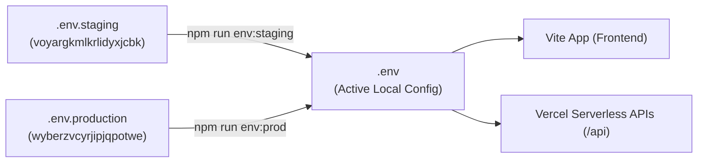

# Sunvine Renewable Energy — Master Operations & Commands Guide

Yeh guide Sunvine Dealer & Admin Quotation Portal ke sabhi **Commands, Architecture, Database Switching aur Workflows** ko explain karti hai.

---

## 1. Quick Command Cheat Sheet

| Category | Command | Action / Work | How it Works |
| :--- | :--- | :--- | :--- |
| **Environment Switcher** | `npm run env:staging` | Local environment ko **Staging DB** (`voyargkmlkrlidyxjcbk`) par switch karta hai. | `.env.staging` ko `.env` me copy karta hai. Vite aur API functions staging DB se connect ho jate hain. |
| **Environment Switcher** | `npm run env:prod` | Local environment ko **Production DB** (`wyberzvcyrjipjqpotwe`) par switch karta hai. | `.env.production` ko `.env` me copy karta hai. Vite aur API functions production DB se connect ho jate hain. |
| **Environment Switcher** | `npm run env:status` | Currently active database environment check karta hai. | Active `.env` file ka `SUPABASE_PROJECT_ID` inspect karke project name display karta hai. |
| **Development** | `npm run dev` | Local development server start karta hai (`http://localhost:5173`). | Vite dev server start hota hai with live reload. |
| **Testing** | `npm test` | Saare 113 automated unit tests run karta hai. | Node.js native test runner `src/utils/__tests__/*.test.js` ko execute karke security, pricing aur auth verify karta hai. |
| **Production Build** | `npm run build` | Production-ready optimized bundle & PWA service worker generate karta hai. | Vite production build chalta hai (`dist/`), chunks optimize hote hain, aur Workbox precache generate hota hai. |
| **Build Preview** | `npm run preview` | Generated `dist/` production build ko local server par run karta hai. | Local HTTP server `dist/` folder serve karta hai for final manual QA. |
| **Database Check** | `node scripts/rollout/check-db.mjs` | Active database ke sabhi 23 tables aur live row counts inspect karta hai. | PostgreSQL se connect karke `information_schema` aur live table status report karta hai. |
| **Database Migration** | `node scripts/rollout/runSql.mjs <file.sql>` | Kisi bhi SQL migration file ko active DB par single safe transaction me run karta hai. | SQL execute karta hai with rollback on error. `--dry-run` flag support karta hai. |
| **Database Full Sync** | `node scripts/rollout/sync-prod-to-staging.mjs` | Production DB ka live data Staging DB me 1-to-1 copy karta hai. | Prod se records extract karke foreign-key order me Staging DB me insert/upsert karta hai. |

---

## 2. Environment Switcher Kaise Kaam Karta Hai? (Deep Dive)

Aapke local machine par 2 Supabase databases ka record maintain hota hai:



### Flow:
1. **Security & Zero Secrets**: `.env.staging`, `.env.production`, aur `.env` sabhi `.gitignore` me protected hain. Git me koi bhi secret commit nahi hota.
2. **Instant Local Switch**: Jab aap `npm run env:prod` ya `npm run env:staging` run karte hain, switcher script background me active `.env` file ko update kar deta hai.
3. **No Code Change Needed**: Aapko frontend ya backend code me koi URL manually change karne ki zaroorat nahi padti.

---

## 3. Database Architecture (Exact 23 Tables Parity)

Dono databases me exact 23 tables configured hain:

```text
1.  admin_accounts             (Super admin credentials & role management)
2.  audit_logs                 (Immutable security audit logs)
3.  bom_catalog                (Core Bill of Materials catalog)
4.  bom_catalog_items          (Field BoS, structure & electrical items)
5.  bos_pricing_matrix         (Balance of System tiered pricing matrices)
6.  customer_files             (Customer solar applications & uploads)
7.  dealer_accounts            (Authorized dealer logins & commissions)
8.  dealer_custom_pricing      (Dealer partner tier margin caps)
9.  dealer_product_overrides   (Dealer product custom overrides)
10. document_master            (Document verification requirements)
11. inverter_benchmark_matrix  (Inverter price benchmark rules)
12. notifications              (System and push notification queue)
13. otp_verifications          (Login and reset OTP tracking)
14. pricing_presets            (Global turnkey base pricing presets)
15. push_subscriptions         (Web push notification endpoint registry)
16. quotation_bom_snapshots    (Immutable historical BOM snapshot logs)
17. quotations                 (Solar proposal records & parameters)
18. solar_banks                (Partner solar financing banks)
19. solar_inverters            (Grid-tied and hybrid solar inverters)
20. solar_kits_presets         (Standard solar kit packages)
21. solar_modules              (TOPCon and Mono PERC solar modules)
22. staff_accounts             (Sales & verification staff accounts)
23. system_settings            (Company profile, governance & tax settings)
```

---

## 4. Production Master Rollout (Step-by-Step)

Jab bhi code production me deploy karna ho:

### Step 1: Run Master Migration on Production DB
- Supabase SQL Editor open karein: `https://supabase.com/dashboard/project/wyberzvcyrjipjqpotwe/sql`
- File [`supabase/migrations/999_production_master_rollout.sql`](file:///e:/repos/dealer-portal-quotation/supabase/migrations/999_production_master_rollout.sql) ka content paste karein aur **Run** karein.
- *(Yeh migration 100% non-destructive hai; existing production values ko safely merge karta hai).*

### Step 2: Quality Gate Verification (Local)
```bash
npm run env:staging
npm test
npm run build
```
- Verify karein ki **113/113 tests pass** ho rahe hain aur build bina error ke finish hota hai.

### Step 3: Git Branch & Deployment
- Saare commits `sumit-updates` branch par commit karein.
- Pull Request create karein targeting `main`.
- PR review aur merge hone par Vercel automatically live deploy kar deta hai:
  👉 `https://sunvine-dealer.vprotech.online`

---

## 5. Security & Core Directives

1. **Ponytail Protocol**: Minimum clean code, zero unused dependencies, reuse existing utilities.
2. **Direct DB Single Source of Truth**: Koi bhi business data client cache ya localStorage me locked nahi rehta. Mount par live database fetch hota hai.
3. **Fail-Closed Security**: Missing pricing ya unauthorized token par endpoints fail-closed 401/403/422 return karte hain.

---

## 6. Slack Thread-Sync Architecture & Operations

Sunvine CRM uses a single Slack Block Kit card per customer file, updated in place (`chat.update`) with thread replies strictly for audit events (stage/status changed, document removed, document replaced).

### 6.1 Server Environment Variables (Vercel & .env)
Configure these server-side only (NEVER expose with `VITE_` prefix):
- `SLACK_BOT_TOKEN`: Slack Bot User OAuth Token (`xoxb-...`). Must have `chat:write` scope.
- `SLACK_FILES_CHANNEL_ID`: Channel ID (e.g. `C08G60JFTU8`). The bot must be invited (`/invite @SunvineBot`).
- `APP_BASE_URL`: Public CRM URL (e.g. `https://sunvine-dealer.vprotech.online` or `https://portal.sunvinesolar.com`) for the "📂 Open Application" button deep links. If unset, the button is omitted safely.

### 6.2 Slack Bot Setup Checklist
1. In Slack API App Console (`api.slack.com/apps`):
   - **Scopes**: Under **OAuth & Permissions** → Bot Token Scopes, add `chat:write`.
   - **Install App**: Install to workspace to get `xoxb-...` bot token.
2. In Slack Channel:
   - Invite bot to channel: `/invite @<BotName>`
3. Set environment variables in Vercel project settings for Production and Preview environments.

### 6.3 Troubleshooting & Operational Notes
- **`not_in_channel`**: The Slack bot has not been invited to the target channel. Run `/invite @<BotName>` in that Slack channel.
- **`invalid_auth`**: The `SLACK_BOT_TOKEN` is incorrect, revoked, or expired. Re-check the token in Slack App Console.
- **`stuck pending` claim**: If an unexpected crash occurs mid-sync, the atomic claim `pending:<timestamp>` auto-expires after 30 seconds. The next event on that customer file automatically reclaims the lock and heals the state.
- **Fail-Safe Guarantee**: Slack API delays or outages never fail HTTP requests to dealers or staff (capped at ~4s total budget). Errors are logged to `audit_logs` and the crash webhook.

